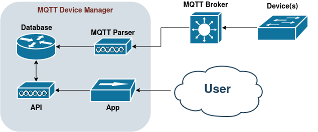

# MQTT Device Manager

In summer of 2022 I did research into IoT device managers, and was rather disapointed by the offerings. I couldn't find anything that met my needs for 1) runs on a Raspberry Pi, 2) integrates easily with Portainer, and 3) handled MQTT messaging. As such, since I'm a glutton for punishment I decided to write my own, and here it is!

As time goes on I'll slowly work my way through the development of this application, using all the design techniques and project management approaches I've learned given my history. Expect this repo to evolve over time as I slowly chip away at the work.

## Roadmap
I have a Trello board set up, Kanban style, to help guide my work on this, located [here](https://trello.com/b/bZsH2kNa/mqtt-device-manager).

### Phase 1
Phase 1 of the project will support my monitoring of soil moisture and climate sensors for indoor plants. This should cover the collection, monitoring, alerting, and storage of MQTT data submitted through a MQTT broker across multiple devices, with each device having multiple measurements coming from its connected sensors. A single device is any singularly contained unit that collects measurements and broadcasts them tom the MQTT broker.

#### Minimum Viable Product Specification
##### 1. Manage MQTT broker subscriptions
The application needs to be able to subscribe/unsubscribe to different MQTT topics that devices are broadcasting on.
Subscriptions will be automatically handled by the creation/editing/deletion of devices & sensors.

##### 2. Store MQTT data in a database
The application must take the incoming data and store it within a database, recoverable with the following relationships:
Device -> Sensor
Device relation must include data such as device name, location and status.
Sensor relation must include data such as value and location.
All data with a temporal component must also include some form of timestamp.

##### 3. Set alert/action thresholds for incoming data
Any measure coming from a device, or any device status, needs to include triggers that will cause an alert to appear within the application. This alert needs to be configurable in the threshold(s) that trigger it (I.E. value on sensor X went below Y threshold), as well as the content of the alert.

##### 4. Subscriptions/Alerts configurable via GUI
Devices, sensors, and alerts must be configurable through a GUI.

#### Architecture

The application will be split into four containers. One which runs the front-end UI in JavaScript, one performing ETL on the MQTT messages using Python, one providing the API in Python/Flask, and one running the database using either MariaDB or SQLite.

The MQTT ETL container will receive MQTT messages from the individual devices, which are relayed by the broker.

#### Design Notes
* My usual Python backend/JavaScript-React frontend should work nicely for this.
    * With some edits. I'll likely need two seperate back-end Python containers for this. One to handle the real-time MQTT messages, and another to handle the configuration/API. 
* Either a MariaDB or a SQLite database is probably best, since there's explicit relationships between devices and sensors, and I will likely need to update some of the more static information of a device (I.E. its location) on occasion, which a MongoDB would not fare very well with.
    * This does mean converting the incoming JSON-formatted MQTT messages into a SQL-compatible structure. This should be easy enough to handle using the same converter approach that I developed with the [New Eden Analytics schemas](https://github.com/Calvinxc1/NEA-Schema/tree/develop).
* Though ideally I'd like to have alerts pop up on my phone, I'm not ready to tackle mobile app development yet. I'll limit it to the React Webapp.
* I think auto-handling the MQTT subscriptions is best for now. I can start by having the topic be `device/{deviceId}/sensor/{sensorId}`.
